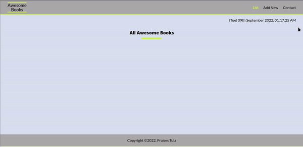

# Awesome Books

> "Awesome books" is a simple website that displays a list of books and allows you to add and remove books from that list.

## Built With (Linter)

- HTML (Webhint)
- CSS (Stylelint)
- JavaScript (Eslint)

## Project Preview

## Authors

👤 **Praises Tula**

- GitHub: [@praisespjmt](https://github.com/PraisesPJMT)
- Twitter: [@praisespjmt](https://twitter.com/PraisesPJMT)
- LinkedIn: [Praises Musa Tula](https://www.linkedin.com/in/praises-tula-9233aa76)

## 🤝 Contributing

Contributions, issues, and feature requests are welcome!

## Show your support

Give a ⭐️ if you like this project!

## 📝 License

This project is [Microverse](https://www.microverse.org/) licensed.